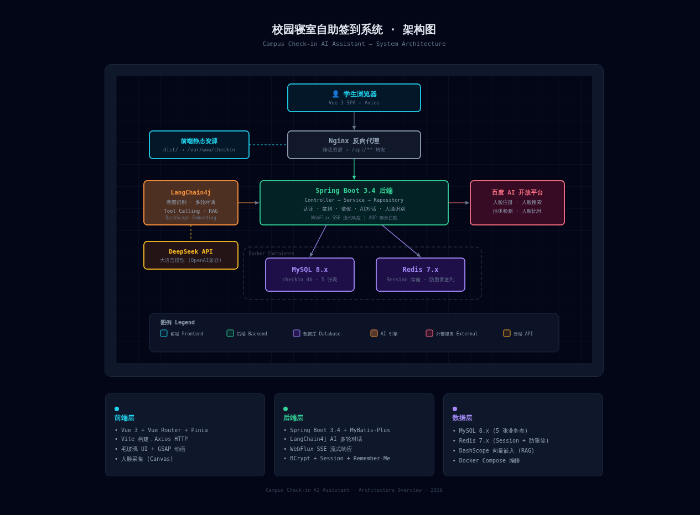
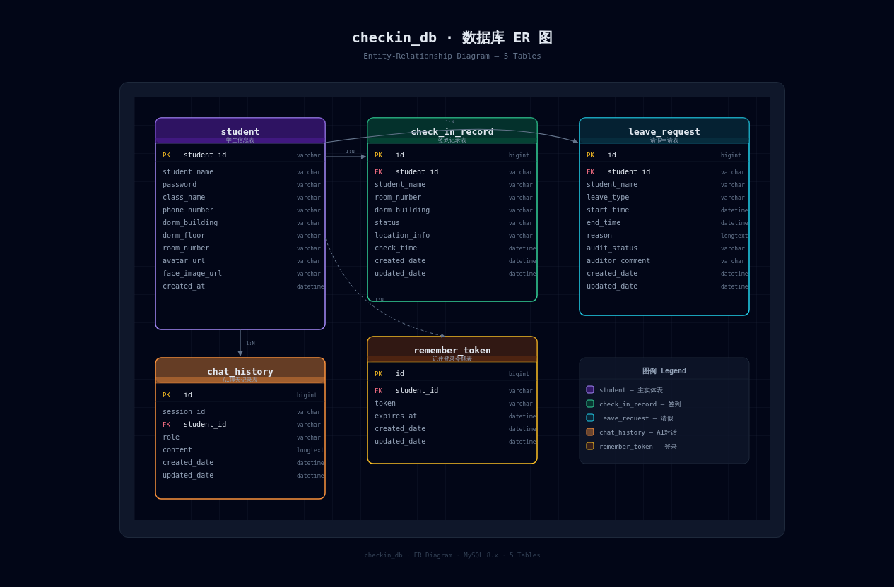

# 🏠 校园寝室自助签到系统

> Campus Check-in AI Assistant — 基于 LangChain4j + Spring Boot 的 AI 签到助手

[](https://openjdk.org/)
[](https://spring.io/)
[](https://vuejs.org/)
[](LICENSE)

---

## 📖 项目简介

校园寝室自助签到系统是一个全栈 Web 应用，学生通过 **自然语言对话** 即可完成寝室签到、请假报备、考勤查询等操作。系统集成 AI 意图识别、GPS 定位验证、人脸识别认证，实现智能化的宿舍考勤管理。

### 核心功能

| 功能 | 说明 |
|------|------|
| 🤖 AI 智能对话 | LangChain4j + DeepSeek 大模型，支持意图识别与多轮对话 |
| ✅ 签到打卡 | GPS 定位 + 人脸双重认证，防止代签 |
| 📋 请假报备 | AI 引导式多轮对话采集请假信息，自动提交申请 |
| 📊 考勤查询 | 自然语言查询个人签到/请假记录 |
| 📚 规则问答 | 基于 RAG 检索增强的校园寝室管理条例问答 |
| 👤 人脸识别 | 百度 AI 人脸注册/识别，支持活体检测 |

---

## 🏗️ 系统架构



<details>
<summary>查看文字版架构说明</summary>

```
┌─────────────────────────────────────────────────────────┐
│                     学生浏览器 (Vue 3)                     │
└──────────────────────┬──────────────────────────────────┘
                       │
              ┌────────▼────────┐
              │  Nginx 反向代理  │
              │ 静态资源 + API   │
              └──┬──────────┬───┘
                 │          │
    ┌────────────▼──┐  ┌───▼────────────────────┐
    │  前端静态资源  │  │  Spring Boot 3.4 后端   │
    │  dist/        │  │  Controller → Service   │
    └───────────────┘  │  → Repository           │
                       │                         │
                       │  ┌─────────┐ ┌────────┐│
                       │  │LangChain│ │百度 AI  ││
                       │  │  4j     │ │人脸识别 ││
                       │  └────┬────┘ └────────┘│
                       └───────┼─────────────────┘
                               │
                    ┌──────────┼──────────┐
                    │     Docker 容器      │
              ┌─────▼─────┐      ┌───────▼───────┐
              │  MySQL 8  │      │   Redis 7     │
              │ checkin_db│      │ Session+防重签 │
              └───────────┘      └───────────────┘
```

</details>

---

## 🗄️ 数据库设计



### 表结构概览

| 表名 | 说明 | 核心字段 |
|------|------|----------|
| `student` | 学生信息 | student_id, name, password, dorm, class |
| `check_in_record` | 签到记录 | student_id, status, location, check_time |
| `leave_request` | 请假申请 | student_id, leave_type, reason, audit_status |
| `chat_history` | AI 聊天记录 | session_id, student_id, role, content |
| `remember_token` | 登录令牌 | student_id, token, expires_at |

> 详细建表语句见 [`sql/checkin_db.sql`](sql/checkin_db.sql)

---

## 🛠️ 技术栈

| 层级 | 技术 | 版本 |
|------|------|------|
| **前端** | Vue 3 + Vue Router + Pinia + Vite | 3.5 / 4.x / 2.x / 8.0 |
| **后端** | Spring Boot + MyBatis-Plus + Spring Data JPA | 3.4 / 3.5 / 6.x |
| **AI** | LangChain4j + DeepSeek + DashScope | 1.0.1-beta6 |
| **数据库** | MySQL + Redis | 8.x / 7.x |
| **人脸识别** | 百度 AI 开放平台 | - |
| **部署** | Docker + Docker Compose + Nginx | - |

---

## 🚀 快速部署

### 环境要求

- JDK 17+
- Node.js 18+
- MySQL 8.x
- Redis 7.x
- Nginx

### 1. 克隆项目

```bash
git clone https://gitee.com/WhiteEmpties/blank.git
cd blank
```

### 2. 初始化数据库

```bash
mysql -u root -p < sql/checkin_db.sql
```

### 3. 配置环境变量

```bash
export SPRING_DATASOURCE_URL="jdbc:mysql://localhost:3306/checkin_db?useUnicode=true&characterEncoding=UTF-8&serverTimezone=Asia/Shanghai"
export SPRING_DATASOURCE_USERNAME=root
export SPRING_DATASOURCE_PASSWORD=your_password
export DEEPSEEK_API_KEY=your_deepseek_key
export BAIDU_API_KEY=your_baidu_key
export BAIDU_SECRET_KEY=your_baidu_secret
export DASHSCOPE_API_KEY=your_dashscope_key
```

### 4. 构建后端

```bash
mvn clean package -DskipTests
# 生成 target/campus-checkin-assistant-1.0-SNAPSHOT.jar
```

### 5. 构建前端

```bash
cd frontend
npm install
npm run build
# 生成 frontend/dist/
```

### 6. 部署启动

```bash
# 后端
java -jar target/campus-checkin-assistant-1.0-SNAPSHOT.jar &

# 前端 → 复制到 Nginx 目录
cp -r frontend/dist/* /var/www/checkin/

# Nginx → 复制配置并重启
cp nginx/checkin.conf /etc/nginx/conf.d/
nginx -t && nginx -s reload
```

### 7. 访问

浏览器打开 `http://your-server-ip` 即可使用。

---

## 📁 项目结构

```
├── frontend/                  # Vue 3 前端
│   ├── src/
│   │   ├── views/             # 页面组件 (登录/首页/签到/请假/记录)
│   │   ├── router/            # 路由配置
│   │   ├── stores/            # Pinia 状态管理
│   │   └── layouts/           # 布局组件
│   └── package.json
├── src/main/java/org/example/
│   ├── controller/            # REST API 控制器
│   ├── service/               # 业务逻辑层
│   ├── aiservice/             # LangChain4j AI 助手定义
│   ├── entity/                # JPA 实体类
│   ├── repository/            # 数据访问层
│   ├── tools/                 # AI Tool Calling 函数
│   └── config/                # 配置类
├── sql/
│   └── checkin_db.sql         # 数据库初始化脚本
├── nginx/
│   └── checkin.conf           # Nginx 反向代理配置
├── Dockerfile                 # Docker 构建文件
├── docker-compose.yml         # Docker Compose 编排
└── pom.xml                    # Maven 依赖配置
```

---

## 📄 开源协议

本项目基于 [MIT License](LICENSE) 开源。

---

**作者**：朗东成（0307124223） · 浙江国际海运职业技术学院 · 大数据技术专业
