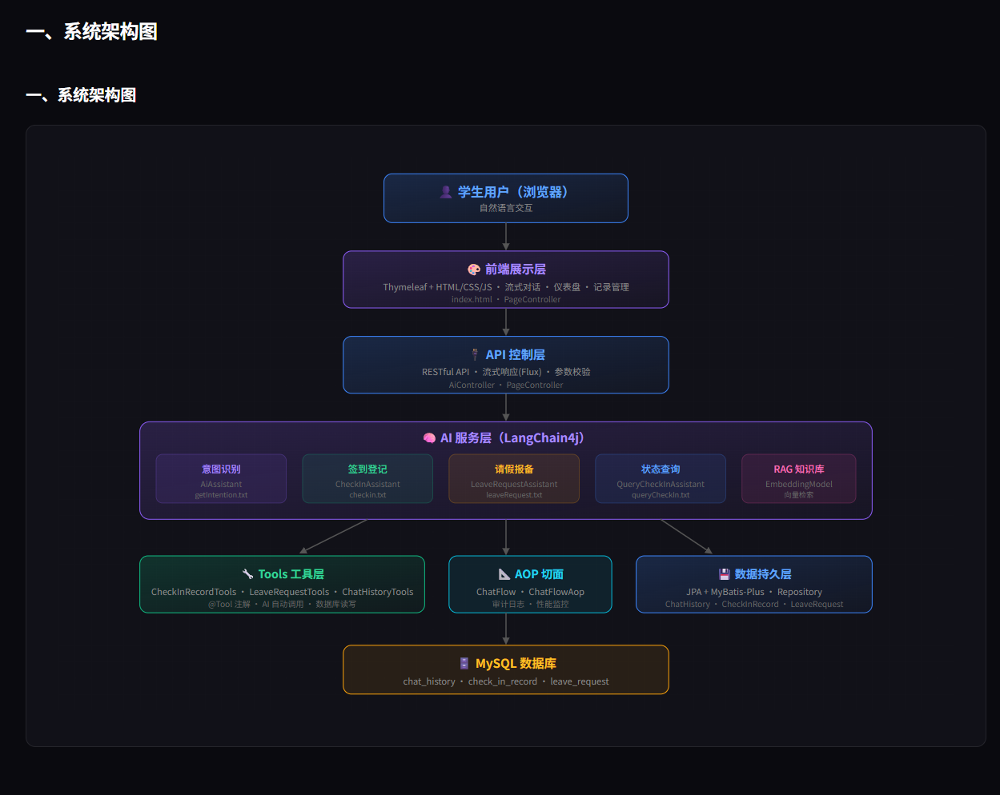
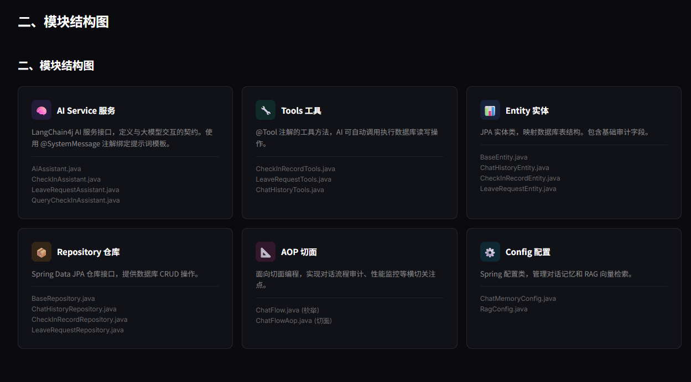
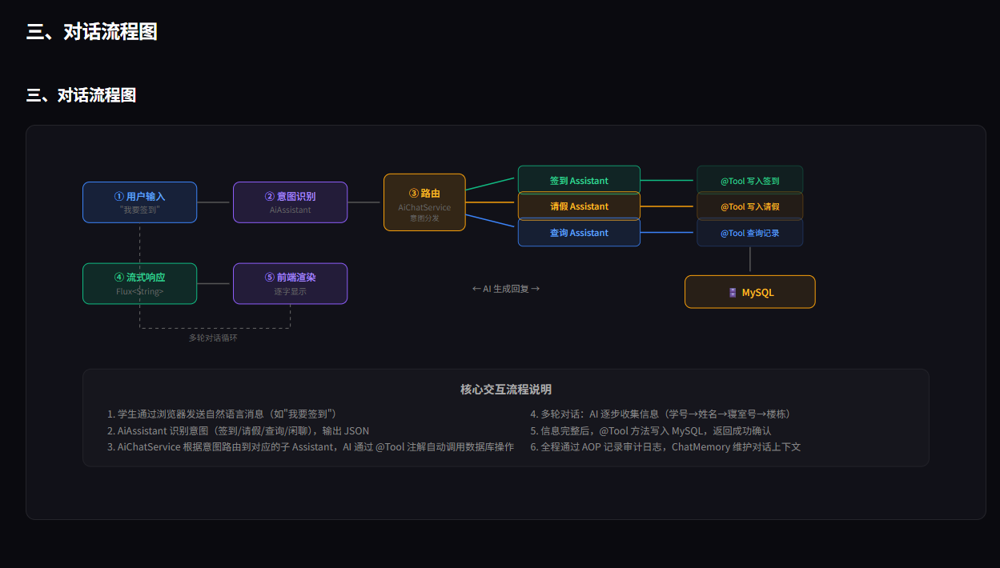
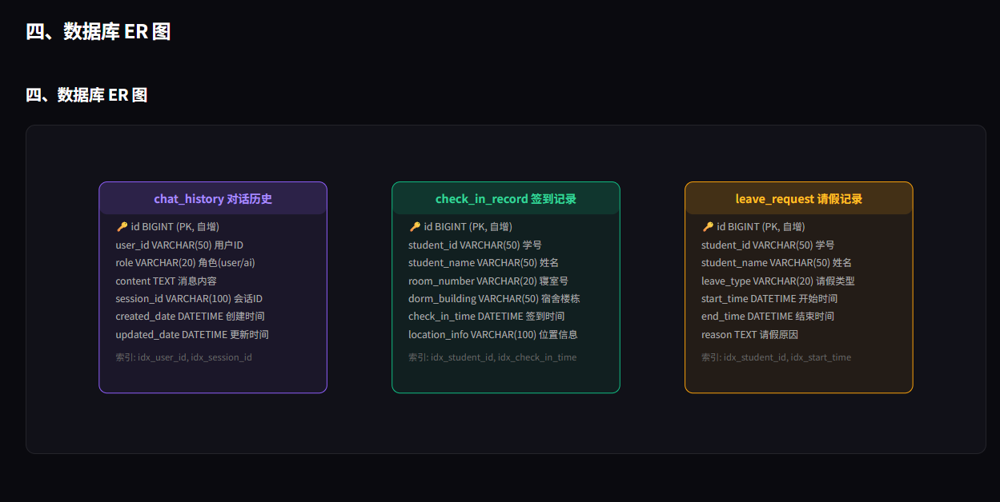
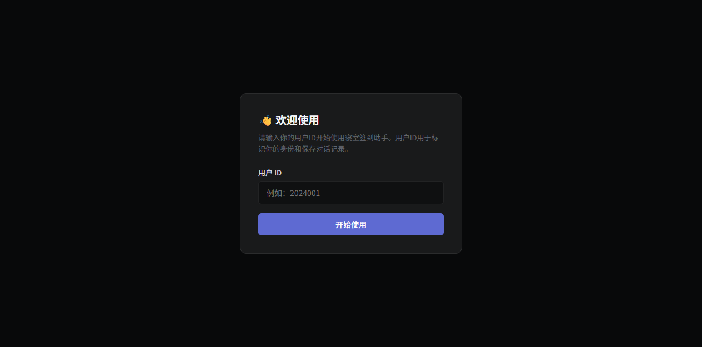
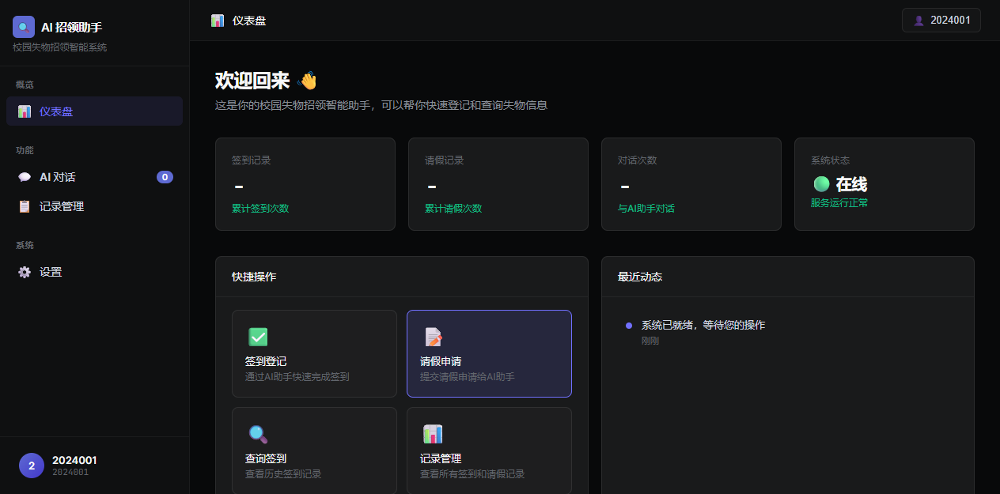
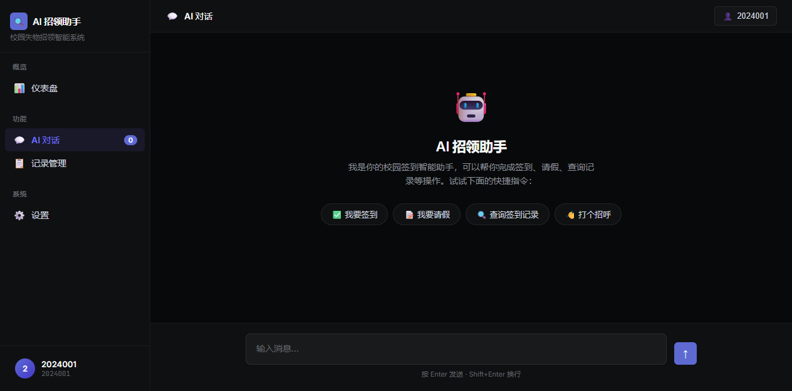
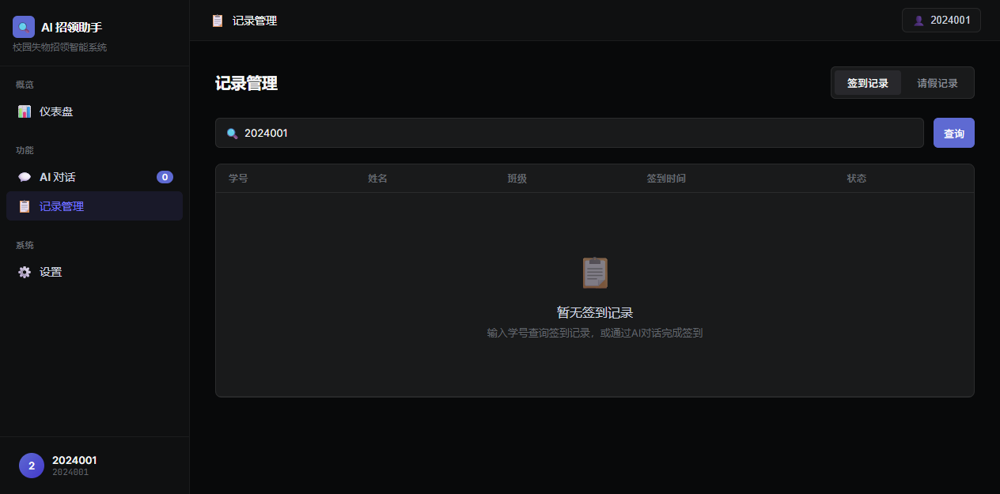

<p align="center">
  <h1 align="center">🏠 校园寝室自助签到系统</h1>
  <p align="center">Campus Dormitory Self-Service Check-in System</p>
  <p align="center">
    
    
    
    
  </p>
</p>

---

## 📖 项目简介 | Project Introduction

### 🇨🇳 中文

基于 **LangChain4j + Spring Boot** 的校园寝室自助签到 AI 助手。学生通过自然语言对话即可完成寝室签到、请假报备、考勤查询等操作，无需手动填写表单。

**核心特性：**
- 🤖 **AI 智能对话** — 基于大语言模型的多轮对话，自动收集签到信息
- 🎯 **意图识别** — 自动识别签到、请假、查询、闲聊等 5 种意图
- 🔧 **Tool Calling** — AI 自动调用后端工具完成数据库读写
- 📊 **仪表盘** — 统计卡片、快捷操作、最近动态一目了然
- 💬 **流式响应** — AI 回复逐字显示，体验流畅
- 📋 **记录管理** — 签到记录、请假记录双标签查询
- 🧠 **RAG 知识库** — 支持向量检索的寝室管理规定问答

### 🇬🇧 English

An AI-powered campus dormitory check-in assistant built with **LangChain4j + Spring Boot**. Students can complete dormitory check-in, leave requests, and attendance queries through natural language conversation.

**Key Features:**
- 🤖 **AI Chat** — Multi-turn dialogue powered by LLM, auto-collects check-in info
- 🎯 **Intent Recognition** — Automatically identifies 5 intents: check-in, leave, query, FAQ, chitchat
- 🔧 **Tool Calling** — AI automatically invokes backend tools for database operations
- 📊 **Dashboard** — Stats cards, quick actions, and activity feed at a glance
- 💬 **Streaming Response** — AI replies display character-by-character for smooth UX
- 📋 **Record Management** — Dual-tab query for check-in and leave records
- 🧠 **RAG Knowledge Base** — Vector retrieval for dormitory management Q&A

---

## 🏗️ 系统架构 | System Architecture

<p align="center">
  
</p>

| 层级 | 说明 | 关键组件 |
|:---:|:---|:---|
| 👤 用户层 | 学生通过浏览器访问 | Chrome / Edge |
| 🎨 前端层 | Thymeleaf + HTML/CSS/JS | index.html |
| 🔌 控制层 | RESTful API + 流式响应 | AiController |
| 🧠 AI 服务层 | LangChain4j 意图识别 + Assistant | AiAssistant 等 |
| 🔧 工具层 | @Tool 注解自动调用 | CheckInRecordTools |
| 📐 AOP 层 | 审计日志 + 性能监控 | ChatFlowAop |
| 💾 数据层 | JPA + MyBatis-Plus | Repository |
| 🗄️ 数据库 | MySQL 8.4 | 3 张业务表 |

---

## 📦 模块结构 | Module Structure

<p align="center">
  
</p>

- **aioutput/** — AI 输出 DTO (IntentionOutput, CheckInOutput, LeaveRequestOutput)
- **aiservice/** — AI 服务接口 (AiAssistant, CheckInAssistant, LeaveRequestAssistant, QueryCheckInAssistant)
- **aop/** — AOP 切面 (ChatFlow, ChatFlowAop)
- **config/** — 配置类 (ChatMemoryConfig, RagConfig)
- **controller/** — 控制器 (AiController, PageController)
- **entity/** — JPA 实体 (BaseEntity, ChatHistoryEntity, CheckInRecordEntity, LeaveRequestEntity)
- **repository/** — 数据仓库 (BaseRepository + 3 个业务仓库)
- **service/** — 业务服务 (AiChatService, AiChatServiceImpl)
- **tools/** — AI 工具 (ChatHistoryTools, CheckInRecordTools, LeaveRequestTools)

---

## 🔄 对话流程 | Dialogue Flow

<p align="center">
  
</p>

| 编号 | 意图 | 示例 | 路由目标 |
|:---:|:---|:---|:---|
| 1 | 签到打卡 | "我要签到" | CheckInAssistant |
| 2 | 请假报备 | "我要请假" | LeaveRequestAssistant |
| 3 | 状态查询 | "签到记录" | QueryCheckInAssistant |
| 4 | 规则问答 | "晚归几点违纪" | RAG 知识库 |
| 5 | 其他/闲聊 | "你好" | 直接回复 |

---

## 🗄️ 数据库设计 | Database Design

<p align="center">
  
</p>

| 表名 | 说明 | 关键字段 |
|:---|:---|:---|
| chat_history | 对话历史 | user_id, role, content, session_id |
| check_in_record | 签到记录 | student_id, room_number, dorm_building, check_in_time |
| leave_request | 请假记录 | student_id, leave_type, start_time, end_time, reason |

---

## 🖥️ 前端界面 | Frontend UI

<p align="center">
  
  
</p>
<p align="center">
  
  
</p>

---

## 🚀 快速开始 | Quick Start

**环境要求:** Java 17+, MySQL 8.0+, Maven 3.8+

```bash
# 1. 克隆
git clone https://gitee.com/WhiteEmpties/blank.git && cd blank

# 2. 创建数据库
mysql -u root -p -e "CREATE DATABASE checkin_db DEFAULT CHARACTER SET utf8mb4;"

# 3. 修改配置 (application.properties 中的数据库和 API Key)

# 4. 运行
mvn spring-boot:run
```

访问 http://localhost:8080

---

## 🛠️ 技术栈 | Tech Stack

| 类别 | 技术 | 版本 |
|:---|:---|:---|
| 后端框架 | Spring Boot | 3.4.4 |
| AI 框架 | LangChain4j | 1.0.1-beta6 |
| AI 模型 | DeepSeek / Qwen | OpenAI 兼容 API |
| 数据库 | MySQL | 8.4 |
| ORM | JPA + MyBatis-Plus | 3.5.11 |
| 前端 | Thymeleaf + 原生 JS | - |
| JDK | OpenJDK | 17 |

---

## 📄 License

本项目仅用于教学用途 | For educational purposes only.

---

<p align="center">
  Made with ❤️ by <b>WhiteEmpties</b> · Powered by LangChain4j + Spring Boot
</p>
